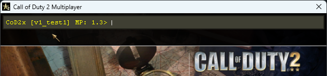
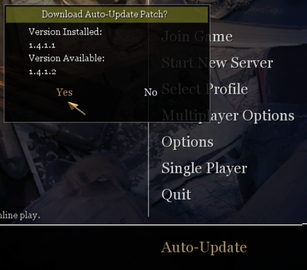
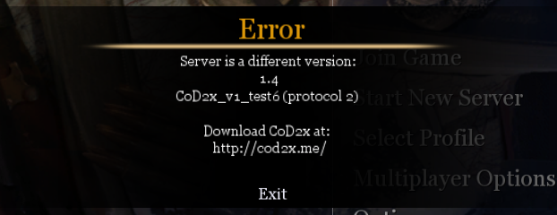
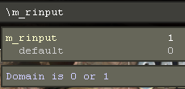
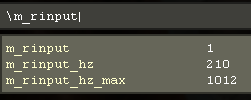
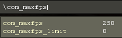
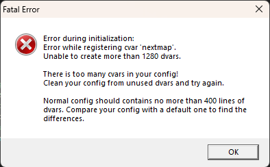
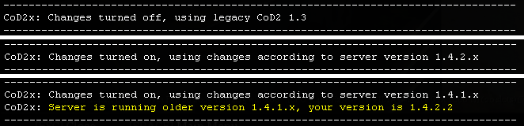
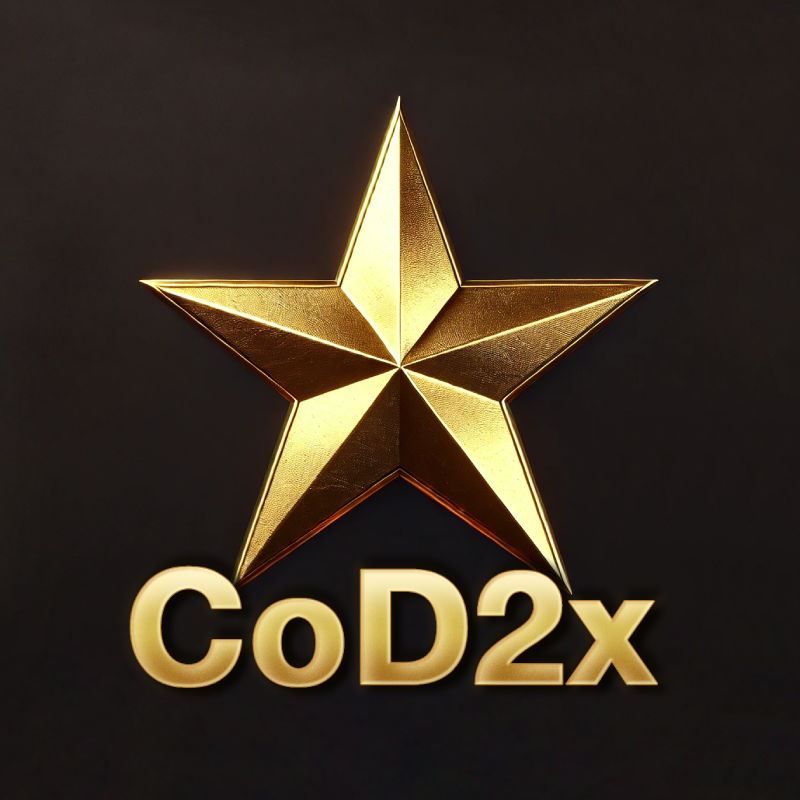

# CoD2x

CoD2x is a modification of Call of Duty 2. It is build on top of 1.3 version.

It focuses on fixing bugs and adding new features to the game.

# Features

#### Changes
- Dialog "Run in safe mode?" is removed
- Dialog "Set Optimal Settings?" and "Recommended Settings Update" is removed
- New text in the console to indicate that CoD2x is loaded
- Changed auto-update server with ability to download the latest version of CoD2x
  - 
- Ability to connect both original 1.3 servers and new 1.4 servers
- New server errors descriptions when non-compatible clients tried to connect to the server
  - 
- Fixed black screen on startup - caused by missing microphone / sound device
- Added requirement to run the game as administrator to fix problems with VirtualStore folder and the need to have write access into Program Files folder (as it was possible in Windows XP)
  - 
- Crouch to stand peak bug fix - matching the animation time to be the same as in 1st view 
  - 
- Fixed "+smoke" bug

#### Improvements
- Added windowed and borderless window mode:
    - windowed mode: `r_fullscreen 0`
    - borderless mode: `r_fullscreen 0` and `r_mode [screen resolution]`
    - fullscreen mode: `r_fullscreen 1` (default)
- Added support for rinput (raw input for mouse movement) 
    - 
    - `m_rinput 0` - turned off, uses Windows cursor possition to get movement (default)
    - `m_rinput 1` - raw mouse movement, dedicated thread, as external Rinput application
    - `m_rinput 2` - raw mouse movement, integrated directly into the game
    - The game is also measuring the refresh rate of the mouse:
        - 
        - `m_rinput_hz` - shows the current refresh rate of your mouse in real time
        - `m_rinput_max` - shows the maximum measured refresh rate
    - If the external Rinput application is used, the internal `m_rinput` is automatically turned off
- Added possibility to restrict FPS via mod (like zPAM) into range 125 - 250 using new cvar `com_maxfps_limit` (the cvar is cheat protected and can be set only by the server)
  - 
- Ignoring custom IWD mods on game start to avoid runtime errors (only files starting with 'iw_' or 'localized_' are loaded)
- Set sv_cheats 1 on disconnect to allow to play demo without the need to do devmap
- Added possibility to change the master server via cvars `sv_masterServer`, `sv_masterPort`
- Improved error message `recursive error after: Can´t create Dvar 'xxx': 1280 dvars already exist`:
    - 
- Added informative texts into console with changes that has been applied when connected to the server:
    - 

# How to install (client on Windows)
1. You need original Call of Duty 2 with version [1.3](https://www.moddb.com/games/call-of-duty-2/downloads/call-of-duty-2-pc-patch-v-13) installed.
2. Download latest version of CoD2x - [CoD2x_1.4.2.2_windows.zip](https://github.com/eyza-cod2/CoD2x/releases/download/v1.4.2.2/CoD2x_1.4.2.2_windows.zip)
3. Extract these files from the archive to the Call of Duty 2 folder, replacing any existing file:
    - 📄 mss32.dll
    - 📄 mss32_original.dll
4. Final structure should look like this:
    - 📁 Call of Duty 2
        - 📁 Docs
        - 📁 main
        - 📁 miles
        - 📁 pb
        - 📄 CoD2MP_s.exe
        - 📄 CoD2SP_s.exe
        - 📄 gfx_d3d_mp_x86_s.dll
        - 📄 gfx_d3d_x86_s.dll
        - 📄 **mss32.dll**
        - 📄 **mss32_original.dll**
        - 📄 ... (other files)
5. The archive also contains additional files that are not required to be installed:
    - 📄 CoD2x Installation and uninstallation manual.txt

# How to uninstall (client on Windows)
1. Delete the following files:
    - 📄 mss32.dll
2. Rename following file:
    - 📄 mss32_original.dll  ->  📄 mss32.dll

# How to install (server on Linux)
1. Download latest version of CoD2x - [CoD2x_1.4.2.2_linux.zip](https://github.com/eyza-cod2/CoD2x/releases/download/v1.4.2.2/CoD2x_1.4.2.2_linux.zip)
2. Extract this file from the archive to the Call of Duty 2 folder:
    - 📄 libCoD2x.so
3. Final structure should look like this:
    - 📁 Call of Duty 2
        - 📁 main
        - 📁 pb
        - 📄 cod2_lnxded
        - 📄 libCoD2x.so
4. The archive also contains additional files that are not required to be installed:
    - 📄 CoD2x Installation and uninstallation manual.txt
    - 📄 cod2_lnxded    (official 1.3 game version)
5. Update chmod for the libCoD2x.so file to be executable:
    - `chmod +x libCoD2x.so`
6. Run the game with LD_PRELOAD, for example:
    - `LD_PRELOAD=libCoD2x.so ./cod2_lnxded +exec server.cfg`
    - 🛈 Its not common that server providers support adding this, only server administrators can do that.
7. Auto-update is enabled by default. Make sure to enable UDP port 20720. If you want to disable auto-update, set `sv_update "0"` or disable UDP port 20720. On server start, the server will check for the latest version of CoD2x and download it if available. File libCoD2x.so will be replaced with the latest version. Process restart is needed to apply the update. 

# How to install for developers
1. Clone this repository.
2. Copy .iwd files from original Call of Duty 2 1.3 main folder to `./bin/windows/main` folder in this repository (iw_01..iw_15 and localized_english_iw00..localized_english_iw11)
3. Instal MinGW-w64 by Brecht Sanders [winlibs-i686-posix-dwarf-gcc-14.2.0-mingw-w64msvcrt-12.0.0-r2](https://github.com/brechtsanders/winlibs_mingw/releases/download/14.2.0posix-19.1.1-12.0.0-msvcrt-r2/winlibs-i686-posix-dwarf-gcc-14.2.0-mingw-w64msvcrt-12.0.0-r2.zip) into `./tools/mingw`

4. Install WSL (Windows Subsystem for Linux) with Ubuntu 24.04 LTS
    - `wsl --install` (should install 'Ubuntu' instance name)
    - `sudo apt update`
    - `sudo dpkg --add-architecture i386`
    - `sudo apt update`
    - `sudo apt install -y make gcc gdb gdbserver:i386 build-essential`
    - `sudo apt install -y libc6:i386 libstdc++5:i386 libgcc1:i386` (runtime libraries to run original CoD2) 
    - `sudo apt install -y gcc-multilib libc6-dev:i386` (development libraries to compile new code)
    - `sudo apt-get install gcc-multilib g++-multilib` (some dependencies for compiling)
    - `exit`
    - `wsl --set-default Ubuntu`
    - |
    - Setup tmux: (enable mouse scrolling)
    - `nano ~/.tmux.conf`
    - `set -g mouse on`
    - `tmux source-file ~/.tmux.conf`
    - |
    - How to get IP of WSL virtual machine to connect from Windows to Linux CoD2x server: 
    - `ip addr show eth0 | grep inet | awk '{ print $2; }' | sed 's/\/.*$//'`
5. Run VSCode as administrator (:warning: needed to be able to run CoD2 also as administrator while debugging)
6. Use VSCode to compile, run and debug

# Repository layout
- 📁 **bin**
    - 📁 **linux** - *Linux server binaries*
    - 📁 **windows** - *Windows game binaries from original CD with 1.3 patch applied*
- 📁 **src**
    - 📁 **linux** - *code related only for Linux server*
    - 📁 **mss32** - *code related for Windows, mimicking mss32.dll*
    - 📁 **shared** - *code shared for both Linux server and Windows version*
    - 📁 **other** - *reversed / testing code*
- 📁 **tools** - *contains external tools for coding, compiling, etc..*
- 📁 **zip** - *zip files are generated here*

To avoid source code duplication, the code that is used for both Linux and Windows is placed in `📁src / 📁shared` folder. Its primarily a server side code. 

The code that is related only for Windows version or Linux server is placed in particular folders `📁src / 📁mss32` or `📁src / 📁linux`, both sharing the shared folder.

# How the Windows mss32.dll works
CoD2MP_s.exe has following dynamic libraries:
- WINMM.dll       
- WSOCK32.dll     
- mss32.dll       <-- *hooking this library*
- d3d9.dll        
- DSOUND.dll      
- KERNEL32.dll    
- USER32.dll      
- GDI32.dll       
- ADVAPI32.dll    
- SHELL32.dll     

These libraries are loaded at runtime when the CoD2MP_s.exe is started.

File mss32.dll is a Miles Sound System dynamic link library used for audio playback.
This file is replaced with our custom mss32.dll, which exports the same functions as the original mss32.dll.

The CoD2MP_s.exe imports 364 functions from original mss32.dll:
- _AIL_set_sample_adpcm_block_size@8
- _AIL_enumerate_3D_providers@12
- _AIL_end_sample@4
- _AIL_set_3D_position@16
- ...

Our version of mss32.dll has the same exported functions as original.
These functions act as a proxy to the original functions in the original mss32.dll.
    
    [CoD2MP_s.exe]
        ↓
    [mss32.dll]            <- this file
        ↓
    [mss32_original.dll]   <- original mss32.dll

When our mss32.dll is loaded, it loads mss32_original.dll and redirect all exported functions.
It also runs patching process that modifies the game memory to fix some bugs and add new features.

# References
- [CoD2rev_Server](https://github.com/voron00/CoD2rev_Server)
- [CoD4x_Server](https://github.com/callofduty4x/CoD4x_Server)
- [zk_libcod](https://github.com/ibuddieat/zk_libcod)
- [Enemy-Territory](https://github.com/id-Software/Enemy-Territory)

## Support
You can support this project by donating via PayPal:

# Logo
